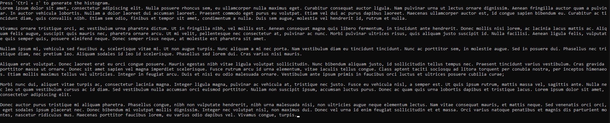
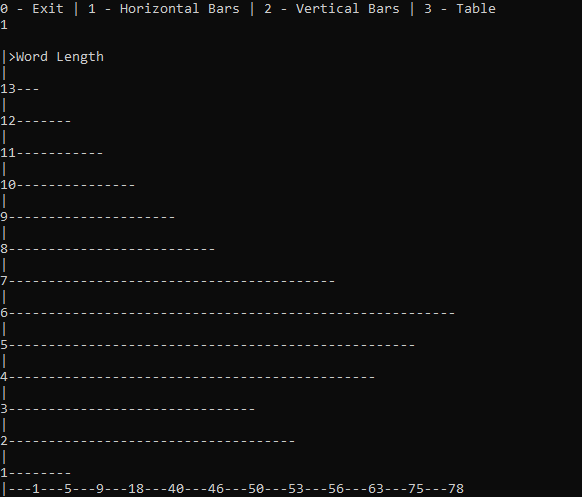
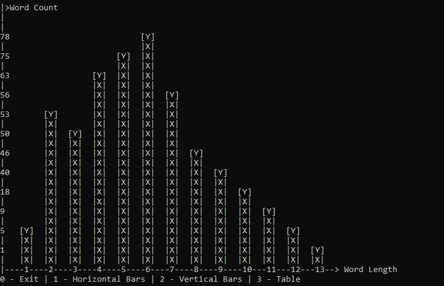
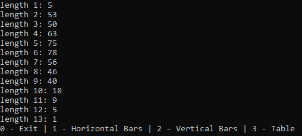

# This is How I'm Learning C :)

I bought the book "The C Programming Language" By Brian W. K. and Dennis M. R. and when I get some free time I read trought it.

## Worth Looking at

I made a couple of histogram and those took a lot of work for a beginner like myself so have a look at it :D. Pls.

### `Histogram.c`
You can copy and paste the code into an online C compiler. It might bug out a little in case the histogram gets to big. 
I recommend: https://www.tutorialspoint.com/compile_c_online.php
This one did not bug the code as much.

## Or just have a peek

### `Exercise 1-13: Write a program to print a histogram of the lengths of words in its input. It is easy to draw the histogram with the bars horizontal; a vertical orientation is more challenging.`

### Text Input

### Horizontal

### Vertical

### Table

### `.exe files`

You can also download the executable but windows, chorme and every other app are jealous and they will flag it as a virus or unsafe ;(.

It's safe tho! You can 100% trust a random person at the internet. 

## Book_Exercises

In this folder you'll find all the challanges the book asks of you.

## Book_Examples_And_Others

In this folder you'll find the examples used in the book and some other snippets. They had to be changed slightly to run on my machine.